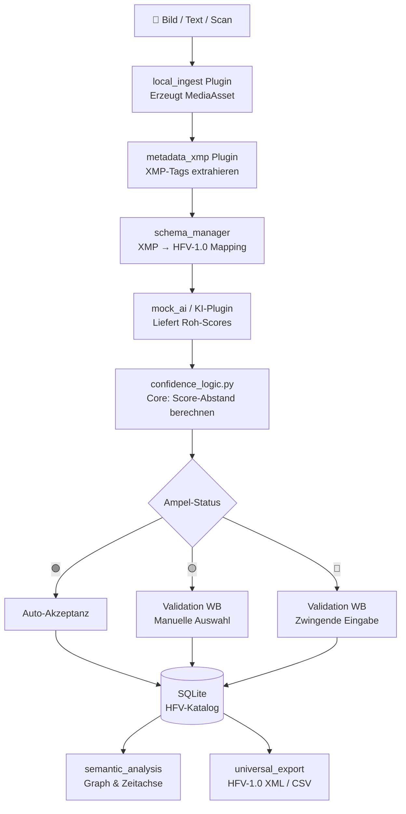
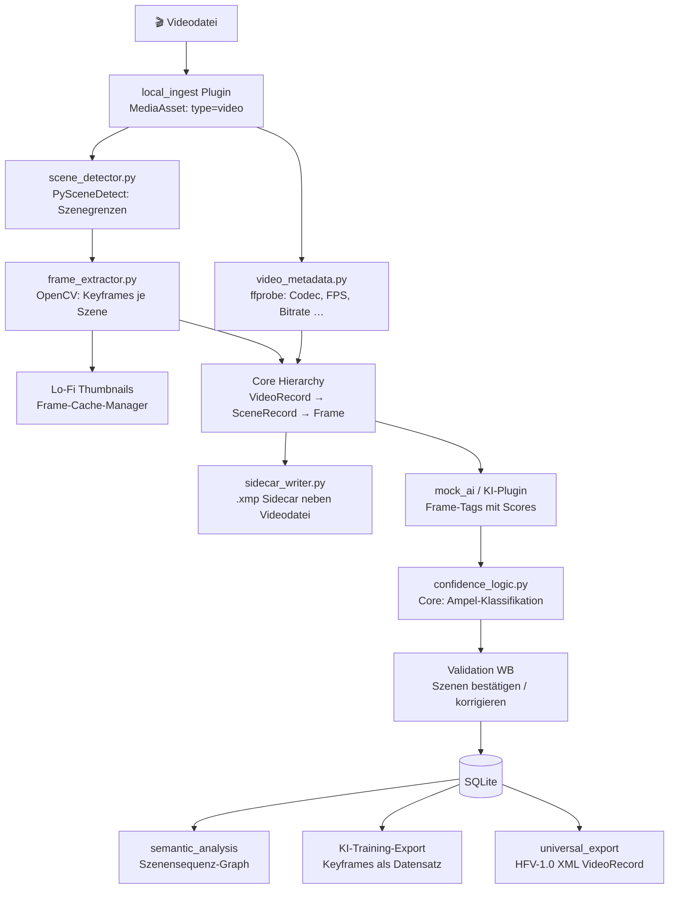

# CineMeta Studio — Architektur-Übersicht (v3)

> **Microkernel-Architektur**: Core definiert Verträge (Datenstrukturen, Schema, Konfidenz-Logik). Plugins liefern oder konsumieren Daten.
> Tech-Stack: Qt 6 / QML + Python / PySide6

---

## Schichten-Modell

```
╔═══════════════════════════════════════════════════════════════════╗
║              QML / Qt Quick — Core-Shell (Hauptfenster)          ║
║                                                                   ║
║  Titelleiste · Menü · Plugin-Statusleiste                        ║
║                                                                   ║
║  ┌─────────────────────────────────────────────────────────────┐  ║
║  │           WorkbenchRouter.qml  (dynamisch)                  │  ║
║  │                                                             │  ║
║  │  Nur aktive Plugins registrieren hier ihre Workbenches.     │  ║
║  │  Bei 0 aktiven Plugins → EmptyState ("Keine Plugins aktiv") │  ║
║  │                                                             │  ║
║  │  [Ingest WB] [Video WB] [Validation WB] [Analysis WB] …    │  ║
║  └──────────────────────┬──────────────────────────────────────┘  ║
║                         │                                         ║
║  ConfidenceBadge.qml ◄──┤  (gestreut nutzbar von allen Plugins)  ║
║  PluginManager.qml      │                                         ║
╚═════════════════════════╪═════════════════════════════════════════╝
                          │  QML ↔ Python Bridge (PySide6)
╔═════════════════════════▼═════════════════════════════════════════╗
║              CORE PACKAGE  cinemeta/  (stabil, kein Plugin-Dep.) ║
║                                                                   ║
║  ── Infrastruktur ─────────────────────────────────────────────  ║
║  plugin_interface.py   ABCs: CineMetaPlugin, CineMetaWorkbench   ║
║                              AIModelPlugin, ExportPlugin         ║
║  plugin_registry.py    Laden · Aktivieren · Deaktivieren        ║
║  event_bus.py          Qt Signals — lose Kopplung (Plugins       ║
║                        kommunizieren NUR über den Bus)           ║
║  persistence.py        SQLite · Asset-Tabellen · Relationen      ║
║                                                                   ║
║  ── domain/ ───────────────────────────────────────────────────  ║
║  assets.py             MediaAsset (polymorph: Bild | Text |      ║
║                        Video-Frame) — Typ, Pfad, Roh-Metadaten,  ║
║                        HFV-Mapping-Status                        ║
║  hierarchy.py          Parent-Child: Film → Szene → Frame        ║
║                        Plugins arbeiten typunabhängig mit Assets ║
║  confidence_logic.py   Berechnet Score-Abstände zwischen KI-     ║
║                        Vorschlägen. Klassifiziert: 🟢 🟡 🔴     ║
║                        (Core-Logik = UX-Versprechen der App)     ║
║                                                                   ║
║  ── schema/ ───────────────────────────────────────────────────  ║
║  schema_manager.py     Liest XSD/JSON dynamisch ein.             ║
║                        Stellt Mapping-API für Plugins bereit.    ║
║  definitions/          hfv-1.0.xsd  (kanonischer Schema-Vertrag) ║
║                                                                   ║
╚═════════════════════════╪═════════════════════════════════════════╝
                          │  CineMetaPlugin Interface
╔═════════════════════════▼═════════════════════════════════════════╗
║                 PLUGIN LAYER  plugins/                           ║
║                                                                   ║
║  ┌──────────────┐  ┌──────────────┐  ┌──────────────────────┐   ║
║  │ local_ingest │  │ metadata_xmp │  │ mock_ai              │   ║
║  │              │  │              │  │  (Dev/Test)          │   ║
║  │ Liefert:     │  │ Liefert:     │  │                      │   ║
║  │ MediaAssets  │  │ XMP-Tags →   │  │ Simuliert            │   ║
║  │ in Hierarchy │  │ HFV-Mapping  │  │ AIModelPlugin-Output │   ║
║  │              │  │ via schema_  │  │ mit Konfidenzwerten  │   ║
║  │ lo_fi_render │  │ manager      │  │ aus JSON             │   ║
║  │ Thumbnails   │  │              │  │                      │   ║
║  │ Lazy Load    │  │ Passthrough  │  │ Austauschbar gegen   │   ║
║  └──────┬───────┘  │ unbekannte   │  │ echte KI-Plugins     │   ║
║         │          │ Tags         │  └──────────────────────┘   ║
║         │          └──────┬───────┘                             ║
║         └─────────────────┘                                      ║
║                    ↓ MediaAsset-Objekte via Event Bus            ║
║  ┌───────────────────────────────────────────────────────────┐   ║
║  │                    video_analysis                         │   ║
║  │                                                           │   ║
║  │  scene_detector.py    PySceneDetect (Cut, Fade, Content)  │   ║
║  │  frame_extractor.py   OpenCV + Frame-Cache-Manager        │   ║
║  │  video_metadata.py    ffprobe (Codec, FPS, Bitrate …)     │   ║
║  │  sidecar_writer.py    .xmp Sidecar neben Videodatei       │   ║
║  │                                                           │   ║
║  │  Extrahierte Frames → Core Hierarchy (als Kinder von      │   ║
║  │  SceneRecord unter VideoRecord)                           │   ║
║  │  Szenen-Scores → confidence_logic.py → 🟢🟡🔴            │   ║
║  └───────────────────────────────────────────────────────────┘   ║
║                                                                   ║
║  ┌──────────────────────┐   ┌──────────────────────────────────┐  ║
║  │ semantic_analysis    │   │ universal_export                 │  ║
║  │                      │   │                                  │  ║
║  │ Konsument (read-only)│   │ Konsument (read-only)            │  ║
║  │ Verändert Core-DB    │   │ Verändert Core-DB nicht          │  ║
║  │ nicht.               │   │                                  │  ║
║  │                      │   │ exporters/                       │  ║
║  │ D3.js / QtCharts     │   │   xml_exporter.py (HFV-1.0 XML) │  ║
║  │ Zeitachse · Graph    │   │   csv_exporter.py                │  ║
║  │ ChromaDB-Vektoren    │   │   jsonld_exporter.py             │  ║
║  └──────────────────────┘   └──────────────────────────────────┘  ║
╚═════════════════════════╪═════════════════════════════════════════╝
                          │
╔═════════════════════════▼═════════════════════════════════════════╗
║                    PERSISTENCE LAYER                             ║
║  ┌──────────────────────┐  ┌─────────────┐  ┌────────────────┐   ║
║  │ SQLite               │  │ ChromaDB    │  │ Filesystem     │   ║
║  │ Assets, Relations,   │  │ (lokal)     │  │ Raw Files      │   ║
║  │ HFV-Katalog,         │  │ Semantik-   │  │ Thumbnails     │   ║
║  │ Konfidenz-Status     │  │ Vektoren    │  │ XMP Sidecars   │   ║
║  └──────────────────────┘  └─────────────┘  └────────────────┘   ║
╚═══════════════════════════════════════════════════════════════════╝
```

---

## Datenfluss A — Bild / Text (klassischer Archiv-Pfad)



---

## Datenfluss B — Video (erweiterter Analyse-Pfad)



---

## Kommunikationsregeln zwischen Plugins

```
Erlaubt:  Plugin  →  Core (domain, schema, confidence_logic, persistence)
Erlaubt:  Plugin  →  Event Bus  →  anderes Plugin (locker gekoppelt)
Verboten: Plugin  →  direkter Import eines anderen Plugins
```

**Event-Bus-Beispiele:**

```python
# video_analysis sendet — local_ingest oder validation hören zu
event_bus.emit("asset.created",    {"asset_id": "…", "type": "video-frame"})
event_bus.emit("confidence.ready", {"asset_id": "…", "status": "yellow", "options": […]})
event_bus.emit("scene.extracted",  {"video_id": "…", "scenes": […]})
```

---

## Base Classes (Core-Verträge)

```python
# cinemeta/plugin_interface.py

from abc import ABC, abstractmethod


class CineMetaPlugin(ABC):
    @property
    @abstractmethod
    def name(self) -> str: ...

    @property
    @abstractmethod
    def version(self) -> str: ...

    @property
    def workbenches(self) -> list["CineMetaWorkbench"]:
        return []   # Plugins ohne eigene Workbench geben [] zurück

    @abstractmethod
    def initialize(self, config: dict, event_bus) -> None: ...

    @abstractmethod
    def teardown(self) -> None: ...


class CineMetaWorkbench(ABC):
    @property
    @abstractmethod
    def id(self) -> str: ...            # z. B. "video-workbench"

    @property
    @abstractmethod
    def label(self) -> str: ...         # Anzeigename in der Navigation

    @property
    @abstractmethod
    def qml_component(self) -> str: ... # Pfad zur .qml-Datei


class AIModelPlugin(CineMetaPlugin):
    """
    KI-Plugin liefert NUR Roh-Scores.
    Die Ampel-Klassifikation (🟢🟡🔴) übernimmt confidence_logic.py im Core.
    """
    @abstractmethod
    def analyze_asset(self, asset_id: str, xmp_data: dict) -> list[dict]:
        """
        Rückgabe-Format (verbindlich):
        [{"label": "Metropolis (1927)", "score": 0.82}, …]
        """
        ...

    def analyze_frames(self, asset_id: str, frame_paths: list[str]) -> list[dict]:
        """
        Optional: Video-Frame-Analyse für video_analysis Plugin.
        Rückgabe: [{"scene_id": "…", "tags": […], "score": 0.87}, …]
        """
        raise NotImplementedError


class ExportPlugin(CineMetaPlugin):
    @abstractmethod
    def export(self, catalog_entries: list[dict], output_path: str) -> None: ...
```

---

## Domain: MediaAsset & Hierarchy

```python
# cinemeta/domain/assets.py

from dataclasses import dataclass, field
from enum import Enum
from typing import Optional

class AssetType(Enum):
    IMAGE      = "image"
    TEXT       = "text"
    VIDEO      = "video"
    VIDEO_FRAME = "video-frame"

@dataclass
class MediaAsset:
    id:           str
    type:         AssetType
    source_path:  str
    raw_metadata: dict = field(default_factory=dict)   # XMP / ffprobe Roh-Daten
    hfv_data:     dict = field(default_factory=dict)   # gemappte HFV-1.0 Felder
    status:       str  = "pending"                     # pending | validated | exported
    parent_id:    Optional[str] = None                 # Referenz auf Parent-Asset


# cinemeta/domain/hierarchy.py

class AssetHierarchy:
    """Verwaltet Film → Szene → Frame Relationen in der SQLite-DB."""

    def add_child(self, parent_id: str, child_id: str) -> None: ...
    def get_children(self, parent_id: str) -> list[str]: ...
    def get_root_assets(self) -> list[str]: ...
    def walk(self, root_id: str):
        """Generator: iteriert tief durch die gesamte Hierarchie."""
        ...
```

---

## Domain: Confidence Logic

```python
# cinemeta/domain/confidence_logic.py

from dataclasses import dataclass
from enum import Enum

class AmpelStatus(Enum):
    GREEN  = "green"   # > threshold UND Abstand groß → Auto-Akzeptanz
    YELLOW = "yellow"  # Mehrere Optionen nah beieinander → manuelle Auswahl
    RED    = "red"     # Bester Score unter Minimum → zwingende Eingabe

@dataclass
class ConfidenceResult:
    status:   AmpelStatus
    best:     dict           # {"label": "…", "score": 0.82}
    options:  list[dict]     # alle Kandidaten (für 🟡-Auswahl)
    distance: float          # Abstand zwischen best und second-best

def classify(
    scores: list[dict],           # [{"label": "…", "score": 0.82}, …]
    threshold_green:  float = 0.85,
    threshold_red:    float = 0.50,
    min_distance:     float = 0.15,
) -> ConfidenceResult:
    """
    Kernlogik des Ampelsystems.
    Wird von allen KI-Plugins und dem video_analysis Plugin aufgerufen.
    """
    if not scores:
        return ConfidenceResult(AmpelStatus.RED, {}, [], 0.0)

    sorted_scores = sorted(scores, key=lambda x: x["score"], reverse=True)
    best   = sorted_scores[0]
    second = sorted_scores[1] if len(sorted_scores) > 1 else {"score": 0.0}
    dist   = best["score"] - second["score"]

    if best["score"] < threshold_red:
        status = AmpelStatus.RED
    elif best["score"] >= threshold_green and dist >= min_distance:
        status = AmpelStatus.GREEN
    else:
        status = AmpelStatus.YELLOW

    return ConfidenceResult(status, best, sorted_scores, dist)
```

---

## HFV-1.0 Schema (Kern + Video-Erweiterung)

```xml
<!-- cinemeta/schema/definitions/hfv-1.0.xsd  (Auszug) -->
<xs:schema xmlns:xs="http://www.w3.org/2001/XMLSchema"
           xmlns:hfv="https://cinemeta.studio/hfv/1.0"
           targetNamespace="https://cinemeta.studio/hfv/1.0">

  <!-- Basisfelder (FilmRecord) -->
  <xs:complexType name="BaseRecord">
    <xs:sequence>
      <xs:element name="hfv:id"           type="xs:string"/>
      <xs:element name="hfv:title"        type="xs:string"/>
      <xs:element name="hfv:year"         type="xs:gYear"    minOccurs="0"/>
      <xs:element name="hfv:country"      type="xs:string"   minOccurs="0"/>
      <xs:element name="hfv:director"     type="xs:string"   minOccurs="0"/>
      <xs:element name="hfv:confidence"   type="xs:decimal"  minOccurs="0"/>
      <xs:element name="hfv:status">
        <xs:simpleType><xs:restriction base="xs:string">
          <xs:enumeration value="auto-accepted"/>
          <xs:enumeration value="manual-validated"/>
          <xs:enumeration value="pending"/>
        </xs:restriction></xs:simpleType>
      </xs:element>
      <!-- Passthrough: unbekannte XMP-Tags bleiben erhalten -->
      <xs:any namespace="##other" processContents="lax"
              minOccurs="0" maxOccurs="unbounded"/>
    </xs:sequence>
  </xs:complexType>

  <!-- VideoRecord erweitert BaseRecord -->
  <xs:complexType name="VideoRecord">
    <xs:complexContent>
      <xs:extension base="hfv:BaseRecord">
        <xs:sequence>
          <xs:element name="hfv:codec"        type="xs:string"  minOccurs="0"/>
          <xs:element name="hfv:resolution"   type="xs:string"  minOccurs="0"/>
          <xs:element name="hfv:fps"          type="xs:decimal" minOccurs="0"/>
          <xs:element name="hfv:duration_sec" type="xs:decimal" minOccurs="0"/>
          <xs:element name="hfv:audio_tracks" type="xs:integer" minOccurs="0"/>
          <xs:element name="hfv:scenes" minOccurs="0">
            <xs:complexType><xs:sequence>
              <xs:element name="hfv:SceneRecord" maxOccurs="unbounded">
                <xs:complexType><xs:sequence>
                  <xs:element name="hfv:scene_id"       type="xs:string"/>
                  <xs:element name="hfv:timecode_in"    type="xs:string"/>
                  <xs:element name="hfv:timecode_out"   type="xs:string"/>
                  <xs:element name="hfv:thumbnail_path" type="xs:anyURI" minOccurs="0"/>
                  <xs:element name="hfv:keyframe_path"  type="xs:anyURI" minOccurs="0"/>
                  <xs:element name="hfv:tags"           type="xs:string" minOccurs="0"/>
                  <xs:element name="hfv:confidence"     type="xs:decimal" minOccurs="0"/>
                  <xs:element name="hfv:status"         type="xs:string" minOccurs="0"/>
                  <xs:any namespace="##other" processContents="lax"
                          minOccurs="0" maxOccurs="unbounded"/>
                </xs:sequence></xs:complexType>
              </xs:element>
            </xs:sequence></xs:complexType>
          </xs:element>
        </xs:sequence>
      </xs:extension>
    </xs:complexContent>
  </xs:complexType>

</xs:schema>
```

---

## Projektstruktur (Ziel nach Phase 7)

```
CineMeta-Studio/
│
├── MASTERPLAN.md
├── ARCHITECTURE.md
│
├── cinemeta/                          ← CORE PACKAGE (kein Plugin-Dep.)
│   ├── __init__.py
│   ├── plugin_interface.py            ← ABCs für alle Plugins
│   ├── plugin_registry.py             ← Laden / Aktivieren / Deaktivieren
│   ├── event_bus.py                   ← Qt-Signals-Kanal
│   ├── persistence.py                 ← SQLite: Assets, Relationen, Katalog
│   │
│   ├── domain/
│   │   ├── __init__.py
│   │   ├── assets.py                  ← MediaAsset (polymorph)
│   │   ├── hierarchy.py               ← Film → Szene → Frame
│   │   └── confidence_logic.py        ← Score-Abstand + Ampel-Klassifikation
│   │
│   └── schema/
│       ├── schema_manager.py          ← XSD/JSON dynamisch laden, Mapping-API
│       └── definitions/
│           └── hfv-1.0.xsd            ← Kanonischer Schema-Vertrag
│
├── plugins/
│   ├── local_ingest/                  ← Phase 2
│   │   ├── plugin.py
│   │   ├── lo_fi_renderer.py
│   │   └── qml/IngestWorkbench.qml
│   │
│   ├── metadata_xmp/                  ← Phase 3
│   │   ├── plugin.py
│   │   └── xmp_engine.py
│   │
│   ├── mock_ai/                       ← Phase 4
│   │   ├── plugin.py
│   │   └── mock_data.json
│   │
│   ├── video_analysis/                ← Phase 5
│   │   ├── plugin.py
│   │   ├── scene_detector.py
│   │   ├── frame_extractor.py
│   │   ├── video_metadata.py
│   │   ├── sidecar_writer.py
│   │   └── qml/VideoWorkbench.qml
│   │
│   ├── semantic_analysis/             ← Phase 6
│   │   ├── plugin.py
│   │   └── qml/AnalysisWorkbench.qml
│   │
│   └── universal_export/              ← Phase 7
│       ├── plugin.py
│       └── exporters/
│           ├── xml_exporter.py
│           └── csv_exporter.py
│
├── qml/                               ← Core-Shell
│   ├── main.qml
│   ├── WorkbenchRouter.qml
│   └── components/
│       ├── ConfidenceBadge.qml        ← 🟢🟡🔴 (global nutzbar)
│       ├── PluginManager.qml
│       └── EmptyState.qml
│
├── main.py
├── requirements.txt
└── pyproject.toml
```

---

## Technologie-Stack

| Komponente | Gewählt | Notiz |
|---|---|---|
| Frontend | Qt 6 / QML | Lazy Loading, fließende UI |
| Logik | Python + PySide6 | KI-Ökosystem |
| Szenerkennung | PySceneDetect | Cut-, Content-, Fade-Detection |
| Video-Metadaten | ffprobe (subprocess) | Präzise, lizenzklar |
| Frame-Extraktion | OpenCV + ffmpeg | Cache-Manager für Performance |
| XMP-Parsing | python-xmp-toolkit | Unknown-Tag-Passthrough |
| Thumbnails | Pillow + Qt ImageProvider | Leichtgewichtig |
| Visualisierung | D3.js (WebView) → QtCharts | D3 für Flexibilität |
| Vektor-DB | ChromaDB (lokal) | Kein Server nötig |
| Persistenz | SQLite | Assets, Relationen, Status |

---

*v3 · 2026-06-10 · Microkernel: Core definiert Verträge, Plugins liefern/konsumieren*
